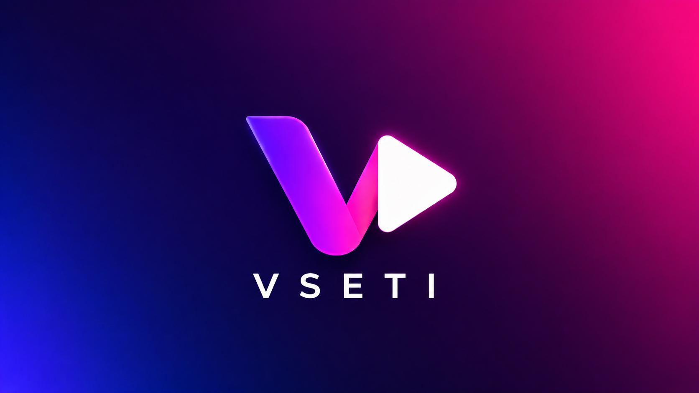

  

<h1 align="center">Vseti Desktop</h1>

  Приложение Vseti для Windows, macOS и Linux.

## Скачать

Готовые установщики находятся в разделе **[Releases](https://github.com/KinoVestnik/Vseti-desktop/releases/latest)**.

Для Windows доступны версии x64, x86 и ARM64. Для macOS доступны сборки Intel и Apple Silicon. Для Linux публикуются AppImage, DEB и RPM.

## Исходный код

Архив соответствующего исходного кода прикрепляется к каждому релизу. Проект распространяется по лицензии [GNU GPL v2](LICENSE).
